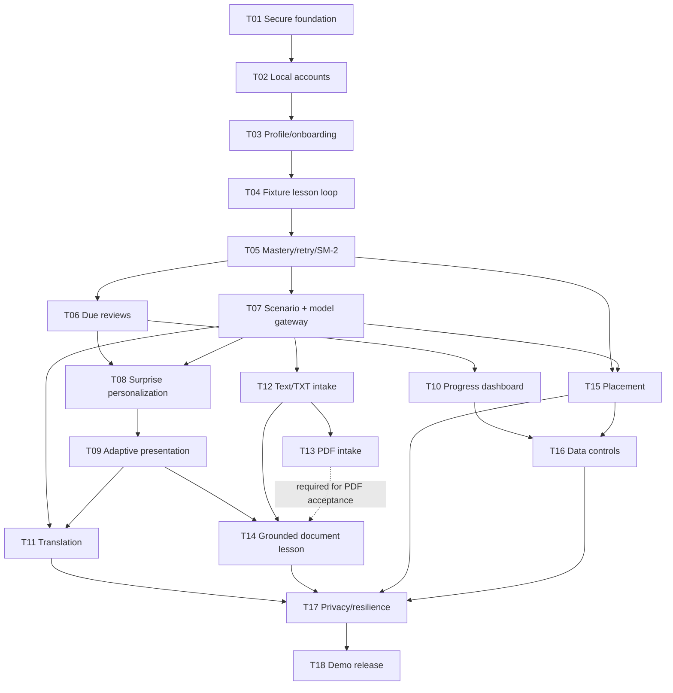

# Incremental Implementation Plan

## Implementation Roadmap

The plan uses vertical slices. Every task ends with a runnable application and a product-level checkpoint; no task is considered complete only because code compiles.

| Order | Task | Working increment delivered | Depends on | Parallel opportunity |
|---:|---|---|---|---|
| 1 | T01 — Secure runnable foundation | App starts safely, navigation works, configuration is diagnosable | None | None |
| 2 | T02 — Local account access | A user can register, sign in, sign out, and return after restart | T01 | None |
| 3 | T03 — Onboarding and learner profile | An authenticated user can create and edit a personalization profile | T02 | None |
| 4 | T04 — Deterministic first lesson loop | A fixture lesson can be studied, answered, completed, and persisted | T03 | None |
| 5 | T05 — Evidence-based mastery and retry | Quiz feedback, varied retries, mastery, and SM-2 behavior are correct | T04 | None |
| 6 | T06 — Due-item review experience | Home offers a skippable review of up to five due items | T05 | None |
| 7 | T07 — Generated scenario lessons | A validated LLM-generated scenario lesson runs through the existing loop | T05 | T10 may begin after T06 while T07 is built |
| 8 | T08 — Personalized surprise lessons | Deterministic topic selection visibly adapts to role and progress | T06, T07 | T11 and T12 may begin after T07 |
| 9 | T09 — Adaptive lesson presentation | Selective annotations, furigana, help, and level support work | T08 | T10 can run in parallel |
| 10 | T10 — Progress dashboard | The user can inspect due work, mastery, weaknesses, and level status | T06 | Can run in parallel with T07–T09 |
| 11 | T11 — Workplace translation | Natural and learning translations are generated without progress/retention side effects | T07, T09 | Can run in parallel with T12–T13 |
| 12 | T12 — Safe text document intake | Pasted/TXT content is safely accepted, chunked, previewed, and confirmed | T07 | Can run in parallel with T10–T11 |
| 13 | T13 — Validated PDF intake | Supported PDFs enter the same section-selection flow; invalid PDFs are rejected | T12 | Can run in parallel with T11 |
| 14 | T14 — Grounded document lesson | A selected source span produces a grounded, traceable lesson | T09, T12; T13 for PDF coverage | None |
| 15 | T15 — Optional adaptive placement | A user can take, accept, ignore, or retake an unverified placement estimate | T05, T07 | Can run in parallel with T14 after T07 |
| 16 | T16 — Profile and data controls | Profile options, progress reset, and complete account deletion work | T10, T15 | None |
| 17 | T17 — Privacy, resilience, and failure hardening | Session-only data, discard warnings, fallback failures, and safe logs are verified | T11, T14, T15, T16 | None |
| 18 | T18 — End-to-end demo release | All acceptance criteria run reliably in a documented under-10-minute demo | T01–T17 | None |

## Implementation Status Ledger

This is a living execution record. After every task, update its status here and add an **Implementation Result** subsection to that task containing: execution date/status, delivered changes, automated and manual verification, important findings, unresolved items, and handoff notes for dependent tasks. A task is marked **Executed** only after its runnable product checkpoint and required tests complete; use **Blocked** or **Partially executed** when an acceptance item remains open.

| Task | Status | Last verified | Result/evidence |
|---|---|---:|---|
| T01 — Secure runnable foundation | **Executed and accepted** | 2026-08-28 | 10 full-suite tests passed; focused secret scan passed; five-page live smoke test passed; see T01 Implementation Result and [verification record](docs/t01-verification.md) |
| T02 — Local account access | **Executed and accepted** | 2026-08-31 | 17 full-suite tests passed; live registration/login/logout/guard/restart walkthrough passed; see T02 Implementation Result and [verification record](docs/t02-verification.md) |
| T03 — Onboarding and learner profile | **Executed and accepted** | 2026-08-31 | 21 full-suite tests passed; live custom-role onboarding/edit/restart walkthrough passed; see T03 Implementation Result and [verification record](docs/t03-verification.md) |
| T04 — Deterministic first lesson loop | **Executed and accepted** | 2026-08-31 | 26 full-suite tests passed; live mixed-answer lesson/restart/retention walkthrough passed; see T04 Implementation Result and [verification record](docs/t04-verification.md) |
| T05 — Evidence-based mastery and retry | **Executed** | 2026-08-31 | 29 full-suite tests passed; live all-wrong/recovery walkthrough passed; see T05 Implementation Result and [verification record](docs/t05-verification.md) |
| T06 — Due-item review experience | Not started | — | Update after T06 execution |
| T07 — Generated scenario lessons | Not started | — | Update after T07 execution |
| T08 — Personalized surprise lessons | Not started | — | Update after T08 execution |
| T09 — Adaptive lesson presentation | Not started | — | Update after T09 execution |
| T10 — Progress dashboard | Not started | — | Update after T10 execution |
| T11 — Workplace translation | Not started | — | Update after T11 execution |
| T12 — Safe text document intake | Not started | — | Update after T12 execution |
| T13 — Validated PDF intake | Not started | — | Update after T13 execution |
| T14 — Grounded document lesson | Not started | — | Update after T14 execution |
| T15 — Optional adaptive placement | Not started | — | Update after T15 execution |
| T16 — Profile and data controls | Not started | — | Update after T16 execution |
| T17 — Privacy, resilience, and failure hardening | Not started | — | Update after T17 execution |
| T18 — End-to-end demo release | Not started | — | Update after T18 execution |

### Delivery gates

- **Foundation gate:** T01–T03 — secure runnable app with a persistent personalized user.
- **Learning-loop gate:** T04–T06 — deterministic offline lesson, evidence, scheduling, and review.
- **Personalization gate:** T07–T10 — generated and adaptive learning with visible progress.
- **Feature-completeness gate:** T11–T16 — translation, documents, placement, and data controls.
- **Release gate:** T17–T18 — privacy/failure hardening and complete demonstration readiness.

## System Understanding

### Product goal

The MVP is a local Streamlit application for global employees in Japanese workplaces. Its defining outcome is a personalized learning loop that can be demonstrated in under ten minutes: profile creation, role/level-adapted lesson, objective quiz, deterministic persisted mastery and review scheduling, and a later lesson that visibly responds to saved progress.

### Primary user flows

1. **Account and onboarding:** register locally, sign in, provide role/tasks/domain and declared level, optionally take placement.
2. **Learn:** choose a generated scenario, personalized surprise topic, pasted text, TXT, or text-based PDF; study 3–7 items and answer 4–6 multiple-choice questions.
3. **Feedback and review:** receive immediate correction, later varied retry, deterministic evidence updates, and up to five due review items.
4. **Translate:** provide English workplace text and communication context; receive natural and learner-accessible Japanese with explanations.
5. **Progress/profile:** inspect mastery and due work, edit preferences, reset learning data, or delete the profile.

### Functional boundaries

- Persist identity, profile, item/progress state, compact evidence, placement summary, and minimal lesson metadata.
- Never persist uploaded source content, generated lesson text, full questions, or translation input/output.
- Exposure and translation do not increase mastery; completed objective answers do.
- The LLM generates content but never controls authentication, authorization, scoring, mastery, or schedules.
- Document explanations must resolve to retained in-session source spans; general examples must be labeled.
- Reviews are prominent but never block a new lesson.

### Technical shape

- Python + Streamlit UI.
- Pydantic feature-specific schemas and validators at every model boundary.
- SQLAlchemy 2.x with SQLite foreign keys enabled; migration support is recommended.
- Password hashing with Argon2id or bcrypt; Argon2id is the recommended default.
- An OpenAI-compatible adapter calls Tsuzumi 2, repairs/retries once on technical/validation failure, then calls GPT-5 mini.
- Deterministic services own item canonicalization, evidence, mastery, SM-2 scheduling, topic selection, source-span validation, and retention decisions.
- Dependency injection/fake model adapters are needed so all failure paths and most acceptance checks run without paid model calls.

### Constraints and non-goals

- Local laptop demo, not public production hosting.
- No enterprise SSO, email, audio, speech, OCR, typed production questions, gamification, lesson history, translation history, or exact JLPT completion claims.
- Maximum document limits are 10 PDF pages and 50 KB extracted text; encrypted and image-only PDFs are rejected.
- Model output and generated answer keys are unverified; placement is recommendation-only.
- Confidential document use must be discouraged, and uploaded text must always be treated as untrusted data.

### Cross-cutting definition of done

Every task must include automated tests for deterministic logic, a manual product walkthrough, restart/refresh checks where persistence matters, and a check that prohibited content was not written to SQLite or logs. Any schema/migration change must work both on a new database and on the database produced by the preceding task.

---

## Detailed Task Specifications

## Task T01 — Secure runnable foundation

**Objective:**
Create a safe, reproducible application shell that starts locally, exposes the required navigation, validates configuration, and contains no embedded credential.

**Why:**
All later increments need a stable runtime and configuration boundary. The PRD explicitly treats the prototype credential as compromised; further model development must not build on that secret.

**Dependencies:**
None. Credential revocation/rotation in the external provider console is an owner action and a release blocker for this task.

**Scope:**
- Establish the Python project, locked/direct dependencies, Streamlit entry point, and test layout.
- Add Home, Learn, Translate, Progress, and Profile navigation with placeholder states.
- Load model/database settings from environment variables and show a non-secret configuration diagnostic.
- Create a local SQLite location and enable foreign-key enforcement on every connection.
- Remove embedded credentials and saved secret-bearing outputs from the prototype notebook and repository history where applicable.
- Add startup, configuration, and secret-pattern tests plus basic run instructions.

**Implementation:**
- Introduce typed settings with separate required and optional values; never print secret values.
- Provide a safe environment-variable template with model IDs/proxy URL placeholders.
- Add a startup health panel that reports database readiness and whether model configuration is present, not its value.
- Add an initial migration mechanism or documented schema bootstrap compatible with later SQLAlchemy migrations.
- Pin supported Python and package versions for reproducibility.

**Acceptance Criteria:**
- [ ] The app starts with one documented command on a clean supported Python environment.
- [ ] All five top-level pages can be opened without an exception.
- [ ] Missing model settings produce a safe “model features unavailable” state while non-model pages still work.
- [ ] SQLite reports foreign-key enforcement enabled.
- [ ] No API key is present in tracked source, notebook cells, notebook outputs, sample configuration, or logs.
- [ ] The exposed prototype credential has been revoked/rotated outside the repository.

**Verification:**
1. Start with no model environment variables and navigate through every page.
2. Confirm the health panel shows database ready and model configuration missing without exposing values.
3. Run the secret scan and automated startup tests.
4. Set dummy model variables and confirm the status changes without making a provider call.
5. Inspect version-control changes and the provider console’s revocation/rotation record.

**Expected Result:**
A safe but intentionally minimal application opens locally and remains usable when no LLM is configured.

**Evidence / Demo:**
Show the five-page app, passing startup/secret tests, foreign-key status, safe missing-config behavior, and external credential-rotation confirmation. This is the T01 verification checkpoint.

**Out of Scope:**
- Authentication and profile persistence.
- Real model calls or learning content.
- Public hosting and production secret management.

### T01 Implementation Result

**Execution status:** **Executed and accepted on 2026-08-28.** The runnable product checkpoint, automated tests, manual browser walkthrough, migration bootstrap, credential cleanup, and external key-rotation confirmation are complete.

#### Delivered implementation

- Created a Python 3.14.3 Streamlit project with pinned direct/development dependencies, a local virtual environment, a source-layout package, and a one-command entry point in [app.py](app.py).
- Implemented Home, Learn, Translate, Progress, and Profile navigation with safe placeholder states in [src/japanese_workplace_tutor/app.py](src/japanese_workplace_tutor/app.py).
- Added typed `JLT_` environment configuration using Pydantic Settings. The API key is represented as a secret type, and the health UI reports only configured/not configured in [src/japanese_workplace_tutor/settings.py](src/japanese_workplace_tutor/settings.py).
- Added SQLAlchemy engine creation, local SQLite directory bootstrap, a safe readiness check, and `PRAGMA foreign_keys=ON` for every application-created SQLite connection in [src/japanese_workplace_tutor/database.py](src/japanese_workplace_tutor/database.py).
- Established Alembic revision `20260828_0001` as the no-domain-table T01 baseline. The migration environment reads the application database URL and enables SQLite foreign keys.
- Added a safe [.env.example](.env.example), repository exclusions, disabled Streamlit usage-statistics collection, and documented clean setup/run/test/migration/security procedures in [README.md](README.md) and [SECURITY.md](SECURITY.md).
- Removed the exposed shared proxy credential and credential-shaped placeholder from [check.ipynb](check.ipynb). The replacement credential remains only in the ignored local environment configuration.
- Added tests for safe settings behavior, secret masking, app startup, all five navigation states, configured and unavailable model-health states, repeated-connection foreign keys, fresh-database migration, and repository/notebook secret patterns.

#### Verification evidence

- Full automated suite: **10 passed**.
- Focused repository/notebook secret scan: **1 passed**.
- Fresh SQLite migration reached `20260828_0001 (head)`; `PRAGMA foreign_key_check` returned no violations.
- Live browser smoke test opened all five pages without an exception.
- With model variables absent, the app remained usable and displayed a non-secret unavailable state.
- With dummy model variables present, the health status changed to configured without making a provider call.
- The owner confirmed that the key previously exposed in the notebook was replaced. No replacement value is stored in tracked project files or this plan.
- Detailed checkpoint evidence is recorded in [docs/t01-verification.md](docs/t01-verification.md).

#### Important findings and decisions

1. The configured API key is a **shared proxy credential**, not one key per model route. GPT is currently accessible; Tsuzumi 2 is currently unavailable. This does not block T01, but T07 must verify retry/fallback using fakes and treat current Tsuzumi unavailability as a provider/model-route failure.
2. T01 intentionally performs no live model request. A configured health state proves only that all required settings are present, not that either model is reachable.
3. Local `.env` values can leak into tests if tests merely delete environment variables because Pydantic then reloads the dotenv file. Tests that exercise missing configuration now override `JLT_MODEL_*` with empty values; future configuration tests must preserve this isolation rule.
4. The secret scan intentionally excludes ignored `.env`, database, virtual-environment, cache, and editor files while scanning project text and notebook JSON, including stored outputs. Secrets must remain only in the ignored local environment.
5. No Git repository was initialized at this checkpoint, so Git-history scanning was not applicable. If version control is initialized or this workspace is imported into an existing repository, run an approved history-aware secret scanner before sharing.
6. The Alembic baseline contains no domain tables. All later migrations must declare `20260828_0001` (or the latest preceding revision) as `down_revision` and prove both clean-database upgrade and upgrade from the previous task state.
7. Streamlit process/session loss is expected to clear in-memory state. T02 must therefore persist accounts in SQLite but require reauthentication after process/session loss.

#### Handoff notes for T02 and later tasks

- Introduce one shared SQLAlchemy declarative metadata/base before creating the `User` table so later entities and Alembic autogeneration use a single schema boundary.
- Add and pin `argon2-cffi` for Argon2id after verifying Python 3.14 compatibility; do not implement custom password cryptography.
- Recommended T02 username policy: Unicode normalize and trim, enforce a case-insensitive normalized unique key, preserve a separate display form, reject empty/control-character values, and document reasonable username/password length limits.
- Store only password hashes and operational timestamps. Do not add email, default/shared credentials, recovery, model calls, or learner-profile fields in T02.
- Scope repository/service methods by authenticated user where applicable and keep the authenticated user ID only in Streamlit session state. Never place password material in session state after hashing/verification.
- Reuse the existing engine factory so SQLite foreign-key enforcement remains consistent. Add migration tests from the T01 database as well as from a fresh database.
- Keep UI errors generic for invalid login, parameterize all persistence through SQLAlchemy, and add duplicate registration, invalid login, restart persistence, route guard, and cross-user isolation tests.
- Continue running the full suite first and the focused secret scan afterward. Update this ledger and add the same structured Implementation Result record when T02 is executed.

## Task T02 — Local account access

**Objective:**
Allow a person to create a local demo account, sign in, sign out, and regain access after an application restart.

**Why:**
All progress must be isolated by user, and the PRD requires lightweight username/password authentication without shared credentials or email.

**Dependencies:**
T01.

**Scope:**
- Implement the User entity, migration, repository/service, registration, login, logout, and authenticated route guard.
- Hash passwords with a modern password hasher and never persist plaintext.
- Enforce unique usernames and clean user boundaries.
- Label the mechanism “demo authentication,” not enterprise identity.
- Add tests for duplicate users, invalid login, cross-user access, and persistence after restart.

**Implementation:**
- Normalize usernames according to a documented rule while preserving a display form.
- Store only password hashes and operational timestamps.
- Use parameterized ORM operations and generic login failure messages.
- Keep authenticated identity in Streamlit session state; force reauthentication when the process/session is lost.
- Add a protected Home state and logout action.

**Acceptance Criteria:**
- [ ] A new username/password creates an account without an email address.
- [ ] The stored password value is a verifiable Argon2id/bcrypt hash and is not the submitted password.
- [ ] Valid login succeeds; invalid username/password fails without revealing which field was wrong.
- [ ] Protected pages cannot expose user data before login.
- [ ] Two users cannot see or mutate each other’s records.
- [ ] After app restart, the account remains and can be used to sign in again.
- [ ] No default/shared credentials exist.

**Verification:**
1. Register two different accounts and sign in/out of each.
2. Attempt duplicate registration and incorrect logins.
3. Inspect the User row to confirm only a password hash is stored.
4. Restart the application and sign in again.
5. Attempt direct navigation to protected pages while signed out.

**Expected Result:**
The local app has persistent, isolated demo identities and a clear authenticated/unauthenticated experience.

**Evidence / Demo:**
Show registration, failed and successful login, logout, protected navigation, restart persistence, and redacted database inspection. This is the T02 verification checkpoint.

**Out of Scope:**
- Password recovery, email verification, SSO, account lockout, and production session cookies.
- Learner profile fields and deletion.

### T02 Implementation Result

**Execution status:** **Executed and accepted on 2026-08-31.** The persistent account flow, authenticated route guard, migration upgrade, automated suite, and live restart walkthrough are complete.

#### Delivered implementation

- Added shared SQLAlchemy declarative metadata and a `users` table containing only identity, Argon2id password hash, and operational timestamp fields.
- Added local registration and authentication services with NFKC normalization, trimmed display names, case-insensitive unique keys, bounded input lengths, generic login errors, and automatic Argon2 rehash support.
- Added migration `20260831_0002`, linked to the T01 baseline, and configured Alembic to use the shared application metadata.
- Added Streamlit registration, sign-in, sign-out, protected navigation, authenticated Home state, and session-only identity. Signed-out users cannot access the five application pages.
- Added pinned `argon2-cffi` runtime dependencies and documented the username, password, persistence, and demo-authentication boundaries in [README.md](README.md).
- Added focused authentication, UI-flow, fresh-migration, and T01-upgrade tests.

#### Verification evidence

- Full automated suite: **17 passed**.
- Focused authentication suite: **5 passed**; focused Streamlit suite: **5 passed**; focused migration suite: **2 passed**.
- Focused repository/notebook secret scan: **1 passed**.
- Live browser walkthrough registered two distinct accounts, opened all five protected pages, signed out, rejected an incorrect login generically, accepted a case-insensitive valid login, and rejected a normalized duplicate registration.
- After a full Streamlit process restart, the session returned to signed out and the persisted account could sign in again.
- Redacted SQLite inspection showed two distinct user IDs and 97-character hashes with the `$argon2id$` prefix. Temporary walkthrough accounts were removed afterward.
- Fresh and T01-state databases both upgraded to `20260831_0002 (head)` with the expected `users` schema and no foreign-key violations.
- Detailed evidence is recorded in [docs/t02-verification.md](docs/t02-verification.md).

#### Important findings and decisions

1. Usernames are NFKC-normalized and trimmed for display, then case-folded for uniqueness and login. They are limited to 3-64 characters and reject Unicode control categories.
2. Passwords are limited to 12-128 characters. Plaintext passwords are used only during the active hash/verification call and are never placed in session state or persistence.
3. Registration signs the new user in. Streamlit session/process loss intentionally clears authentication and requires another login; the account itself remains in SQLite.
4. T02 has no user-owned learning records yet. The UI exposes no user lookup or mutation surface, and authenticated identities remain distinct; future repositories must require the current authenticated user ID for every owned query and mutation.
5. Schema creation remains migration-owned. Setup and upgrades must run `python -m alembic upgrade head` before starting the application.

#### Handoff notes for T03 and later tasks

- Add learner-profile ownership with a non-null foreign key to `users.id`, and scope every profile repository operation by the authenticated user ID.
- Validate the session user before reading or writing future owned data; never accept an owner ID from an editable UI control.
- Preserve the normalized username and password policy, generic authentication failures, and session-only credential boundary.
- Extend migration tests from `20260831_0002` and keep fresh-database coverage.
- Logout must clear future in-session lesson/document state as those features are introduced.

## Task T03 — Onboarding and learner profile

**Objective:**
Collect and persist the learner information required to personalize content and allow it to be edited later.

**Why:**
Role, tasks, domain/tools, and level drive every generated learning experience. Declared and estimated levels must remain separate.

**Dependencies:**
T02.

**Scope:**
- Implement LearnerProfile and any normalized task storage/migration.
- Require role/title, at least one typical task, and declared level.
- Support optional technologies/tools/business domain.
- Provide searchable common-role suggestions while accepting free text.
- Suggest editable task chips based on selected roles.
- Store declared level, nullable estimated working level, source, and confidence separately.
- Add romaji preference, default off; permit beginners to enable it.

**Implementation:**
- Redirect first-time users to onboarding and return completed users to Home.
- Define allowed level values: complete beginner, N5–N1, and unsure.
- Treat role/task suggestion data as UI help, not a closed taxonomy.
- Validate fields server-side and scope all reads/writes to the authenticated User ID.
- Provide Profile editing for these fields; placement controls remain visibly unavailable until T15.

**Acceptance Criteria:**
- [ ] Required fields prevent incomplete onboarding with actionable messages.
- [ ] Suggested and free-text roles both work.
- [ ] Suggested tasks can be removed, edited, and supplemented.
- [ ] Optional tools/domain can be omitted or saved.
- [ ] Declared level can change without creating item mastery or overwriting estimated level.
- [ ] Saved profile values survive sign-out and app restart.
- [ ] Each user sees only their own profile.

**Verification:**
1. Complete onboarding using a suggested role and edited tasks.
2. Repeat with another account and a free-text role.
3. Change declared level and verify estimated level/mastery remain unchanged.
4. Sign out, restart, sign in, and confirm the profile is restored.
5. Inspect Home to see a personalized greeting/summary using the saved role and level.

**Expected Result:**
An authenticated user completes onboarding and has a persistent profile suitable for personalization.

**Evidence / Demo:**
Show required validation, role search/free text, task chips, persisted profile, and separate declared/estimated fields. This is the T03 verification checkpoint.

**Out of Scope:**
- Placement questions and level estimation.
- Progress reset/account deletion.
- LLM-generated role suggestions.

### T03 Implementation Result

**Execution status:** **Executed and accepted on 2026-08-31.** The persistent onboarding flow, user-scoped profile editor, personalized Home state, migration upgrade, automated suite, and live restart walkthrough are complete.

#### Delivered implementation

- Added a one-to-one `learner_profiles` table owned by `users.id`, with structured typical tasks, optional tools/domain, separate declared and estimated levels, level source/confidence, romaji preference, and operational timestamps.
- Added Pydantic-validated profile input and a user-scoped `ProfileService` for profile creation, lookup, and updates. Text is NFKC-normalized, control characters are rejected, tasks are trimmed and deduplicated, and every query is constrained by the authenticated user ID.
- Added searchable common-role suggestions that accept unrestricted custom roles, plus removable and extensible task suggestions. Role suggestions remain local UI assistance rather than a stored taxonomy.
- Added mandatory first-login onboarding, editable Profile controls, a visibly unavailable placement control for T15, and a personalized Home summary using the saved role, tasks, optional domain, and declared level.
- Added migration `20260831_0003`, linked to the T02 account schema, with unique ownership, cascading deletion, allowed-level/source checks, and bounded confidence.
- Added focused service, Streamlit, and migration tests for validation, isolation, free-text persistence, profile editing, declared/estimated level independence, sign-out/login restoration, clean installation, and T02 upgrade.

#### Verification evidence

- Full automated suite: **21 passed**.
- Focused profile service suite: **3 passed**; focused Streamlit suite: **6 passed**; focused migration suite: **2 passed**.
- Focused repository/notebook secret scan: **1 passed**.
- Fresh and T02-state databases both upgraded to `20260831_0003 (head)` with the expected profile ownership and no foreign-key violations.
- Live browser walkthrough created a custom `Solutions architect` profile, replaced suggested tasks with two edited tasks, saved an optional domain and `JLPT N4`, changed only the declared level to `JLPT N3`, and restored the complete profile after sign-out/sign-in.
- After a full Streamlit process restart, authentication was cleared as designed; signing in returned directly to personalized Home with the persisted `JLPT N3` profile.
- Detailed evidence is recorded in [docs/t03-verification.md](docs/t03-verification.md).

#### Important findings and decisions

1. Typical tasks are stored as a JSON array on the one-to-one profile row. T03 always reads and replaces the small ordered set as one validated unit; a separate task table would add joins and ordering logic without a current independent task identity or lifecycle.
2. Declared level updates intentionally do not write `estimated_working_level`, `level_source`, or `level_confidence`. T15 can add placement-specific mutation without changing the learner-owned declared value.
3. Profile inputs accept free-text roles and tasks after NFKC normalization. Suggestions are a local deterministic mapping and never constrain persisted values or require a model call.
4. First-time authenticated users cannot reach protected navigation until required onboarding fields are valid. Completed users return to Home, and Profile uses the authenticated session user ID rather than an editable owner value.
5. Romaji preference defaults off but can be enabled at any level. Presentation behavior remains owned by T09.

#### Handoff notes for T04 and later tasks

- Use `ProfileService.get_profile(authenticated_user_id)` as the personalization boundary; do not query profile rows by role, username, or client-supplied owner IDs.
- T04 fixture lessons may read role, tasks, tools/domain, declared level, and romaji preference, but must not mutate profile level state or infer mastery from those values.
- Keep lesson content and questions out of profile persistence. New user-owned learning records must retain the same non-null foreign-key ownership and user-scoped service pattern.
- T15 should introduce an explicit service operation for estimated-level changes and preserve declared level exactly as T03 does.
- Logout must clear future in-session lesson/document state in addition to the existing authenticated identity.

## Task T04 — Deterministic first lesson loop

**Objective:**
Deliver the first complete study-and-quiz loop using a deterministic fixture lesson, with compact persisted progress but no persisted lesson/question content.

**Why:**
The scoring and retention contract must be proven independently of model variability before LLM content is introduced.

**Dependencies:**
T03.

**Scope:**
- Implement LearningItem, UserItemProgress, ReviewAttempt, and CompletedLessonMetadata entities and migrations.
- Render one 5–8 minute workplace fixture with 3–7 target items and 4–6 supported multiple-choice questions.
- Support meaning, reading, and contextual-cloze question rendering.
- Record exposure separately from answered evidence.
- Score answers in application code and update a simple initial deterministic mastery/schedule state.
- Persist only compact evidence and minimal lesson metadata.

**Implementation:**
- Define stable canonical item identifiers and item categories: kanji, vocabulary, grammar.
- Store JLPT provenance/confidence fields even when fixture values use known references.
- Keep active lesson text/questions solely in session state.
- Make first submission immutable/idempotent so reruns and double clicks cannot duplicate evidence.
- Prevent incomplete/abandoned lessons from creating completion metadata; already submitted answers may remain valid evidence.

**Acceptance Criteria:**
- [ ] The fixture lesson renders its passage, items, examples, and 4–6 MCQs.
- [ ] Answering a question produces one compact evidence record and deterministic progress change.
- [ ] Merely opening/reopening the lesson can increment exposure but cannot increase mastery.
- [ ] Completing the quiz writes topic ID, difficulty, studied item IDs, and timestamp only.
- [ ] SQLite contains no passage, explanation, question, option, or answer-feedback text.
- [ ] Refresh/double-submit does not duplicate an attempt.
- [ ] Restart preserves progress and completion metadata but cannot replay the lesson.

**Verification:**
1. Open the fixture and inspect mastery before answering.
2. Reveal/read content without answering and confirm mastery is unchanged.
3. Submit a mix of correct/incorrect answers, then finish the lesson.
4. Inspect Progress/database fields and verify prohibited text is absent.
5. Restart the app and confirm progress remains while lesson content does not.

**Expected Result:**
A real user can finish a non-LLM lesson and see persistent evidence-based progress with correct retention boundaries.

**Evidence / Demo:**
Record before/after progress, completion metadata, idempotent submission, restart behavior, and a database content audit. This is the T04 verification checkpoint.

**Out of Scope:**
- Delayed retry and full SM-2 outcome rules (T05).
- Due-item reviews and generated content.
- Typed/sentence-production questions.

### T04 Implementation Result

**Execution status:** **Executed and accepted on 2026-08-31.** The deterministic lesson loop, compact user-scoped evidence, provisional schedule, migration upgrade, automated suite, live walkthrough, restart check, and content-retention audit are complete.

#### Delivered implementation

- Added `LearningItem`, `UserItemProgress`, `ReviewAttempt`, and `CompletedLessonMetadata` models with user ownership, foreign keys, bounded values, and uniqueness constraints.
- Added migration `20260831_0004`, linked to the T03 profile schema, with clean-install and T03-upgrade coverage.
- Added a validated fixture lesson containing five kanji/vocabulary/grammar targets, a workplace passage and examples, and five meaning/reading/contextual-cloze questions.
- Added a user-scoped `LessonService` that records exposure separately, scores answers in application code, applies a conservative initial mastery/schedule update, rejects unknown questions/options, makes submissions immutable/idempotent, and gates/idempotently writes completion metadata.
- Added Learn rendering for target-item study, objective practice, immediate result/explanation, recap, completion, and safe abandonment. Active passage/questions/feedback remain in Streamlit session state and are cleared on logout/session loss.
- Added a Progress view for persisted exposure, correct/incorrect counts, initial mastery, next review, and latest minimal completion metadata.
- Added stable ASCII canonical item IDs and a database audit proving that replayable lesson content is not persisted.

#### Verification evidence

- Full automated suite: **26 passed**.
- Focused lesson/retention suite: **4 passed**; focused Streamlit suite: **7 passed**; focused migration suite: **2 passed**.
- Pylance and VS Code diagnostics reported no errors in touched Python files.
- Fresh and T03-state databases both upgraded to `20260831_0004 (head)` with no foreign-key violations.
- Live browser walkthrough rendered all five items and all three supported question forms, submitted three correct and two incorrect answers, showed immediate feedback, completed once, and displayed the expected compact Progress rows.
- Live SQLite inspection found five items, five progress rows, five attempts, one completion, **zero replayable-content matches**, and **zero foreign-key violations**.
- Browser refresh cleared authentication and active lesson content; automated restart coverage restored compact progress/completion metadata without a replayable lesson session.
- Detailed evidence is recorded in [docs/t04-verification.md](docs/t04-verification.md).

#### Important findings and decisions

1. T04 uses a provisional conservative policy: exposure never changes mastery; a correct answer adds `0.10` and schedules one day later; an incorrect answer adds no mastery and schedules ten minutes later. T05 replaces this with the approved versioned dimension-aware mastery and simplified SM-2 policy.
2. Idempotency is enforced by a SHA-256 key derived from the random lesson-session ID and fixture question ID, unique per user. Repeated submissions return the original correctness/progress and cannot duplicate evidence.
3. Active lesson content is fixture-defined application data copied into session state for the active run. Persistence contains only canonical item/category/JLPT metadata, compact correctness/form evidence, progress/schedule values, and minimal completion metadata.
4. Canonical item IDs use ASCII semantic slugs rather than lesson expressions. This keeps identity stable while preventing an ID from duplicating question-option or lesson text in SQLite.
5. Submitted answers remain valid evidence when a lesson is left unfinished, while completion metadata requires all five unique submissions. This implements the planning assumption for abandoned answers.
6. T04 does not claim corrective retry, skill-dimension evidence, Again/Hard/Good/Easy outcomes, mastery attainment, or SM-2 behavior; those remain explicitly owned by T05.

#### Handoff notes for T05 and later tasks

- Extend `ReviewAttempt` with dimension, mapped outcome, and policy version while retaining compactness and immutable original failures; never persist stems, options, explanations, or feedback.
- Extend `UserItemProgress` with dimension scores, consecutive-review state, interval/ease, and UTC schedule fields through a migration based on `20260831_0004`.
- Introduce an injectable-clock golden policy suite before replacing the provisional T04 update constants.
- Add delayed varied retries through the existing fixture/question boundary and preserve the same user/idempotency constraints.
- Continue using application code as the sole scoring and scheduling authority. T07 model schemas must not expose writable mastery, evidence, or schedule fields.

## Task T05 — Evidence-based mastery and delayed retry

**Objective:**
Complete the deterministic mastery, skill-dimension, corrective-feedback, varied-retry, and simplified SM-2 behavior required by the PRD.

**Why:**
A correct-looking lesson is unsafe if guessing or retry behavior can falsely mark mastery. This is the product’s main evidence-integrity boundary.

**Dependencies:**
T04.

**Scope:**
- Track recognition, reading, contextual use, and grammar application where applicable.
- Show immediate correction and an explanation after an incorrect answer.
- Schedule a different delayed question for the same concept.
- Preserve the original failed attempt and store retry success as recovery evidence.
- Map evidence to Again, Hard, Good, and guarded Easy outcomes.
- Implement deterministic mastery changes, consecutive-review counts, SM-2 interval/ease, and next-review timestamps.

**Implementation:**
- Create a documented, versioned scoring policy with golden test vectors.
- Treat one correct MCQ as a small evidence gain, never mastery.
- Require varied forms and separate successful reviews before strongest mastery/Easy status.
- Use an injectable clock so schedules are testable and timezone-consistent (UTC storage, local display).
- Keep persisted evidence compact: item, form/dimension, correctness, first/retry marker, mapped outcome, timestamp, and policy version—not full question text.

**Acceptance Criteria:**
- [ ] Incorrect first attempts map to Again and remain in history after recovery.
- [ ] Correct-after-failure maps to Hard/recovery and does not replace the first result.
- [ ] Eligible first-try varied success maps to Good.
- [ ] Easy is impossible from one answer or one review session.
- [ ] Repeated varied success can eventually earn Easy/mastery according to the documented policy.
- [ ] Retry question type/content differs from the failed question while testing the same canonical item.
- [ ] Schedule and mastery golden tests are deterministic across runs.

**Verification:**
1. Follow an all-wrong path and inspect immediate correction, retry insertion, and Again schedule.
2. Pass a delayed retry and inspect both evidence rows plus Hard recovery.
3. Follow first-try and repeated-review test paths using a controlled clock.
4. Attempt to earn Easy with one answer and verify it is rejected.
5. Compare actual mastery/interval/ease values with published golden examples.

**Expected Result:**
Quiz behavior produces explainable, repeatable progress without erasing mistakes or over-crediting guesses.

**Evidence / Demo:**
Show UI feedback plus golden evidence/schedule traces for Again, Hard, Good, and Easy guard cases. This is the T05 verification checkpoint.

**Out of Scope:**
- LLM-written feedback quality evaluation.
- Typed answers and free-form grading.
- Official JLPT certification logic.

### T05 Implementation Result

**Execution status:** **Executed on 2026-08-31.** The deterministic policy, persisted evidence, migration, automated checks, and live product checkpoint are complete.

#### Delivered implementation

- Replaced the provisional T04 score update with documented policy `t05-v1`, covering recognition, reading, contextual use, grammar application, Again/Hard/Good/Easy mapping, mastery guards, consecutive successful reviews, and deterministic SM-2 interval/ease updates.
- Added one alternate-form corrective question for every fixture question. Incorrect first attempts show immediate correction; retries appear after first-pass practice, preserve the original failure, and must be attempted before lesson completion.
- Persisted compact dimension, outcome, retry marker, policy version, mastery, interval, ease, and consecutive-review state without persisting prompts, options, explanations, or feedback.
- Added Alembic revision `20260831_0005`, including conservative defaults and classification of existing T04 attempt rows as `t04-provisional`.
- Extended Progress with latest outcome, interval, ease, and consecutive successful review state.
- Published policy constants and golden vectors in [README.md](README.md).

#### Verification evidence

- Full automated suite: **29 passed**; `git diff --check` passed.
- Focused lesson policy suite: **6 passed**; clean/T04 migration suite: **2 passed**; Streamlit wrong-answer/retry acceptance path passed.
- Clean migration and populated T04 upgrade both reached `20260831_0005 (head)` with no foreign-key violations.
- Live browser walkthrough at `http://localhost:8502/` completed five wrong first attempts, displayed five immediate corrections, required five different-form retries, labeled each successful recovery Hard, unlocked completion, and displayed persisted Progress.
- Live compact-evidence inspection showed five immutable Again rows plus five Hard retry rows. Each recovered item ended at mastery `0.08`, interval `1`, and ease `2.15`; the temporary verification account was then removed.
- The retention test includes fixture and retry passages, prompts, options, explanations, examples, and recap and found none in SQLite.
- Detailed evidence is recorded in [docs/t05-verification.md](docs/t05-verification.md).

#### Important findings and decisions

1. Policy `t05-v1` defines mastery as `0.80`. Non-Easy or single-form evidence is capped at `0.79`; Easy requires two prior consecutive first-try successes in separate sessions plus at least two successful forms.
2. Again is due in ten minutes with interval zero; Hard is due in one day; Good uses 1 day, then 3 days, then interval times ease; Easy uses at least 4 days times ease times `1.3`.
3. A recovery does not erase or downgrade the original failure. It creates a second immutable evidence row and resets the consecutive first-try-success count.
4. Corrective practice is delayed until all first-pass fixture questions are answered. This gives a genuine intervening-question delay without introducing timers or background state.
5. Existing T04 mastery/count data is retained, but new policy fields start conservatively and prior attempts are labeled `t04-provisional`; migration does not retroactively infer stronger mastery.

#### Handoff notes for T06 and later tasks

- T06 should select due items using `next_review_at <= injected_clock()` and reuse this policy service rather than writing schedule fields directly.
- Review sessions need distinct session IDs and alternate forms so Good/Easy guards continue to use separate sessions and varied evidence correctly.
- Limit due-item selection to five, keep new lessons available, and preserve answer idempotency for every review submission.
- Use `last_outcome`, interval/ease, and compact dimensions for display and selection only; model-generated content must never set them.
- Continue testing both clean migrations and upgrades from the populated `20260831_0005` database.

## Task T06 — Due-item review experience

**Objective:**
Turn persisted schedules into a user-facing, skippable review workflow of at most five due items.

**Why:**
Spaced review closes the learning loop and must become Home’s primary action when due without blocking new learning.

**Dependencies:**
T05.

**Scope:**
- Query due progress records by authenticated user and current time.
- Change Home primary action based on whether reviews are due.
- Build a short review using deterministic item/question templates.
- Limit a review session to five items.
- Apply the same feedback/evidence/SM-2 services as lessons.
- Keep “Start a lesson” available and reviews skippable.

**Implementation:**
- Order due items deterministically by overdue duration, weakness, and stable tie-breaker.
- Select a question form that supplies missing/weak evidence rather than blindly repeating one form.
- Prevent duplicate review sessions from scheduling the same submitted evidence twice.
- Show the next due date/result summary after completion.

**Acceptance Criteria:**
- [ ] With no due items, Home’s primary action is Continue learning/Start a lesson.
- [ ] With due items, Review due items is primary and displays the due count.
- [ ] A review contains no more than five items.
- [ ] Skipping review leaves schedules unchanged and new lesson access remains visible.
- [ ] Submitted review answers update evidence/mastery/schedules exactly once.
- [ ] Completing a review changes Home and next-review displays consistently.

**Verification:**
1. Use a controlled clock to test no-due and due states.
2. Seed more than five due items and confirm only five are selected in deterministic order.
3. Skip once and confirm no data changed.
4. Complete mixed review answers and verify scheduling/evidence.
5. Return Home and confirm the primary action/count updates.

**Expected Result:**
The user can act on due work from Home, skip it safely, and see deterministic schedule changes.

**Evidence / Demo:**
Show Home before due, Home with more than five due, a five-item review, skip behavior, and post-review Home. This is the T06 verification checkpoint.

**Out of Scope:**
- Generated review questions.
- Push/email reminders.
- Blocking lesson access until reviews are complete.

## Task T07 — Validated generated scenario lessons

**Objective:**
Generate a role/level-adapted lesson from an English or Japanese scenario through the complete existing lesson loop, with strict schemas and the required provider fallback.

**Why:**
This is the first LLM-assisted vertical slice. It must reuse trusted deterministic progress code rather than allowing model output to change state directly.

**Dependencies:**
T05. T06 is recommended but not required for scenario generation.

**Scope:**
- Implement an OpenAI-compatible provider adapter for configured Tsuzumi 2 and GPT-5 mini model IDs.
- Define strict lesson/item/question/feedback Pydantic schemas.
- Add scenario input and explicit mode display: Generate a lesson or Explain Japanese text.
- Validate 3–7 target items, 4–6 allowed MCQs, answer keys, canonical references, level support, and unique IDs.
- Implement Tsuzumi call → one Tsuzumi repair/retry on technical/validation failure → GPT fallback.
- Run validated output through T04/T05 rendering, scoring, and persistence.

**Implementation:**
- Separate prompts, provider transport, parsing, validation, and deterministic domain services.
- Treat the scenario as content, never as system instructions.
- Log selected model, latency/status, attempt number, and fallback reason without prompt/response content or secrets.
- Preserve typed scenario input and show a concise retry action if all attempts fail.
- Supply fake adapters/fixtures for success, timeout, malformed JSON, invalid answer key, fallback, and total-failure tests.

**Acceptance Criteria:**
- [ ] English and Japanese scenarios show an explicit detected/default mode that the user can confirm/change.
- [ ] A valid generated lesson meets structural limits and completes through deterministic scoring.
- [ ] Invalid/partial model output is never rendered or scored.
- [ ] Tsuzumi technical/validation failure triggers one Tsuzumi repair/retry, then GPT fallback if still invalid.
- [ ] Merely weak style does not trigger fallback.
- [ ] Total failure preserves scenario input, shows safe retry, and changes no progress.
- [ ] Normal UI does not expose provider/model implementation details.

**Verification:**
1. Generate and finish one English-scenario lesson and one Japanese-scenario lesson.
2. Use fake adapters to demonstrate direct success, repaired success, fallback success, and total failure.
3. Inject malformed schema/answer keys and confirm nothing renders or scores.
4. Inspect safe operational logs and database retention.
5. Confirm model output cannot directly submit mastery/schedule fields.

**Expected Result:**
A scenario produces a valid personalized lesson while deterministic application code remains authoritative for progress.

**Evidence / Demo:**
Show one real/provider-configured lesson if available plus deterministic fallback/failure recordings and data audits. This is the T07 verification checkpoint.

**Out of Scope:**
- Uniform model-quality evaluation and stylistic fallback.
- Document upload/source spans.
- Learner-visible model selection.

## Task T08 — Personalized surprise lessons

**Objective:**
Generate a “surprise me” lesson from an application-selected topic brief that visibly adapts to profile, weak/due/unseen items, and recent history.

**Why:**
The core MVP promise is not generic generation; a later lesson must visibly respond to role and demonstrated progress.

**Dependencies:**
T06 and T07.

**Scope:**
- Define a small extensible workplace-topic catalog with IDs, role/task tags, situations, and difficulty hints.
- Compute deterministic weights from role/tasks, weak dimensions, due items, unseen situations, and recent topic IDs.
- Select a topic brief in application code and ask the model to generate within it.
- Reuse one or two due items only when a tagged/contextual match exists.
- Persist only minimal completed topic metadata already allowed by the PRD.
- Expose a concise “Why this lesson?” explanation based on application factors, not hidden model reasoning.

**Implementation:**
- Make tie-breaking/test seeding explicit so selection is reproducible.
- Penalize recently completed topic IDs to reduce repetition.
- Define cold-start behavior from role, tasks, declared/estimated level, and unseen topics.
- Validate that generated items/questions refer to the selected brief and that reused due items use canonical IDs.

**Acceptance Criteria:**
- [ ] Surprise lesson works with no scenario/document.
- [ ] Same saved state and selection seed yields the same topic brief.
- [ ] Recent topics are measurably down-weighted.
- [ ] Weak/due items influence selection but do not force an unnatural topic.
- [ ] At most two due items are reused in a new lesson.
- [ ] Completing/failing targeted questions changes a subsequent brief in an explainable test case.
- [ ] “Why this lesson?” cites profile/progress/topic factors without claiming LLM certainty.

**Verification:**
1. Generate a cold-start surprise lesson and inspect its role/task match.
2. Complete it, generate again, and confirm recent-topic penalty.
3. Create a known weak item and due item, then compare selected brief/why explanation.
4. Repeat with a fixed seed/state to prove determinism.
5. Verify only topic/difficulty/item IDs/timestamp persist.

**Expected Result:**
The user can see and explain how saved progress affects the next generated lesson.

**Evidence / Demo:**
Show before/after topic-selection traces and two lessons whose differences correspond to recorded evidence. This is the T08 verification checkpoint.

**Out of Scope:**
- A comprehensive manually curated role pack.
- Uniform randomness or opaque model-selected topics.
- Exact claims that a topic is objectively JLPT-aligned.

## Task T09 — Adaptive lesson presentation

**Objective:**
Present generated lessons at a comprehensible challenge level with selective annotations, adaptive furigana, optional romaji, and on-demand help.

**Why:**
The lesson must be learnable, not merely personalized by topic. Known items should not be over-annotated, while every stretch item needs support.

**Dependencies:**
T08.

**Scope:**
- Classify items as known/current, near-level, stretch, or uncertain using estimated/declared level plus item mastery.
- Target approximately 80% familiar/current language and 20% supported stretch content.
- Add selective inline reveals for reading, meaning, grammar, workplace nuance, furigana, and optional romaji.
- Keep known/mastered items unannotated unless help is requested.
- Store JLPT reference/model-estimate provenance and confidence.
- Label uncertain or general guidance appropriately.

**Implementation:**
- Extend schemas with structured annotation anchors and support fields.
- Add application-side checks that each declared stretch item has support.
- Build a stable annotation renderer that does not use unsafe HTML.
- Respect romaji preference; default hidden and never require it.
- Record help/reveal only as exposure/telemetry if retained; never as positive mastery evidence.

**Acceptance Criteria:**
- [ ] A lesson displays selective rather than blanket annotations.
- [ ] Mastered items are initially unannotated but can receive explicit help.
- [ ] Every validated stretch target has a reading/meaning/grammar support path as applicable.
- [ ] Furigana appears for unfamiliar kanji and respects learner state.
- [ ] Romaji is hidden by default and follows the profile toggle.
- [ ] Reveals/help do not increase mastery.
- [ ] Low-confidence model-estimated levels do not act as hard exclusion gates.

**Verification:**
1. View the same fixture/generated content under beginner and advanced profiles.
2. Mark an item mastered and confirm its default annotation disappears while help remains.
3. Toggle romaji and compare rendering.
4. Reveal all help and verify mastery is unchanged.
5. Submit a deliberately unsupported stretch fixture and confirm schema/application validation rejects it.

**Expected Result:**
Lesson support adapts to the learner while progress remains evidence-based.

**Evidence / Demo:**
Show side-by-side beginner/advanced rendering, mastered-item behavior, support validation, and unchanged mastery after reveals. This is the T09 verification checkpoint.

**Out of Scope:**
- Audio, pronunciation, listening, and speech assessment.
- Full linguistic/JLPT data curation.
- Source-linked document annotations (T14).

## Task T10 — Progress dashboard

**Objective:**
Give the learner an honest, actionable view of due work, mastery categories, weaknesses, improvement, and level status.

**Why:**
Users need to verify that progress persisted and understand what the system will adapt next; this is also essential demonstration evidence.

**Dependencies:**
T06.

**Scope:**
- Show due review count and primary next-review action.
- Summarize mastery by kanji, vocabulary, and grammar.
- Show useful weak skill dimensions and recent evidence-based improvement.
- Compare declared level with nullable estimated working level/source/confidence.
- Add item-level drill-down with counts, last/next review, interval, and provenance where useful.
- Avoid gamification and exact JLPT completion percentages.

**Implementation:**
- Compute dashboard views from persisted structured records only.
- Define “recent improvement” as a documented time-window/score delta, not generated prose.
- Provide empty/cold-start states and avoid divide-by-zero/misleading charts.
- Ensure all queries are scoped to current user and perform adequately for MVP-sized data.

**Acceptance Criteria:**
- [ ] Cold-start dashboard clearly explains that answered evidence is needed.
- [ ] Due count and action match Home exactly.
- [ ] Category and skill summaries match underlying item records.
- [ ] Recent improvement changes only from eligible completed answers.
- [ ] Declared and estimated levels are visually distinct with source/confidence.
- [ ] No exact JLPT completion percentage, points, badges, streaks, or leaderboard appears.
- [ ] Another user’s progress is never included.

**Verification:**
1. Inspect a new user’s empty dashboard.
2. Complete known answer paths and compare expected category/skill deltas.
3. Advance a controlled clock and compare due counts across Home/Progress.
4. Switch users and verify isolation.
5. Search the UI for disallowed gamification/JLPT completion claims.

**Expected Result:**
The learner can inspect exactly the progress signals used by personalization without inflated claims.

**Evidence / Demo:**
Show cold-start and populated dashboards reconciled to known answer evidence and Home due counts. This is the T10 verification checkpoint.

**Out of Scope:**
- Gamification, social comparison, exported reports, and certified JLPT assessment.
- Persistent lesson replay.

## Task T11 — Workplace translation

**Objective:**
Translate English workplace text into natural professional Japanese and a learner-accessible version, with explicit context and no persistence/mastery side effects.

**Why:**
Translation is a primary product flow and must preserve politeness/intent while adapting explanations to known language.

**Dependencies:**
T07 and T09.

**Scope:**
- Accept English text plus audience relationship, channel, intent, urgency/tone.
- Visibly apply defaults for any missing context rather than silently guessing.
- Generate validated natural and learning versions.
- Explain differences, unfamiliar vocabulary/grammar, register, politeness, and workplace nuance.
- Apply adaptive furigana and optional romaji.
- Guarantee no translation input/output is persisted and no mastery is awarded.

**Implementation:**
- Add a feature-specific translation schema and semantic validation that both versions are present.
- Include profile/known-item summary rather than full progress history in the model request.
- Treat submitted text as untrusted content.
- Keep current translation only in session state and clear it on logout/session loss.
- Reuse safe provider failure/retry behavior from T07.

**Acceptance Criteria:**
- [ ] All required context controls exist; omissions produce visible default assumptions.
- [ ] Output clearly labels Natural workplace Japanese and Learning version.
- [ ] Explanations cover differences and register/politeness.
- [ ] Learning simplification does not remove required politeness or change intended meaning in test fixtures/review.
- [ ] Furigana/romaji follow learner settings.
- [ ] Translating/revealing explanations leaves mastery, evidence, and schedules unchanged.
- [ ] Input/output cannot be found in SQLite or content logs and disappears after session restart/logout.

**Verification:**
1. Translate the same request for a manager and a peer and compare register.
2. Omit each context value and verify displayed defaults.
3. Compare natural/learning versions and inspect explanation completeness.
4. Record progress before/after translation and confirm no change.
5. Inspect storage/logs, then restart/logout and confirm content is gone.

**Expected Result:**
A context-aware translation can be used and learned from in-session without being treated as demonstrated mastery or retained history.

**Evidence / Demo:**
Show manager/peer outputs, visible defaults, two labeled versions, no-progress delta, and retention audit. This is the T11 verification checkpoint.

**Out of Scope:**
- Translation history, document translation, human certification, and automatic mastery gain.
- Simplifying away mandatory business politeness.

## Task T12 — Safe pasted/TXT document intake and section selection

**Objective:**
Safely accept pasted Japanese/mixed text and TXT files, identify intent, create 2–4 candidate sections, and let the learner confirm an authoritative source span.

**Why:**
Document learning needs a secure, inspectable ingestion boundary before model-generated explanations can be trusted. The PRD blocks untrusted uploads until prompt-injection handling is resolved.

**Dependencies:**
T07. The minimum prompt-injection policy described below must be accepted before enabling uploads.

**Scope:**
- Show a confidentiality warning before input/upload.
- Accept pasted text and plain-text TXT with encoding/error handling and a 50 KB extracted-text limit (assumption to confirm for TXT).
- Route English-only input to scenario generation rather than Japanese document explanation.
- Extract headings/candidate chunks and suggest 2–4 previews.
- Let the learner confirm one section; retain source plus offsets in session only.
- If scenario and file are supplied, use scenario only as focus while file remains authoritative.
- Treat all source text as untrusted data, not instructions.

**Implementation:**
- Enforce MIME/extension/content consistency, byte/text limits, normalization, and safe rendering.
- Delimit untrusted source in prompts, prohibit source-triggered tool/config/instruction changes, minimize privileges, and validate all output against schemas and source offsets.
- Define source offsets as Unicode code-point half-open ranges `[start, end)` unless the UI technology requires a documented conversion.
- Use deterministic chunking first; the model may rank/summarize previews but may not invent source text.
- Clear source on logout/session expiry and never log it.

**Acceptance Criteria:**
- [ ] Warning appears before pasted/TXT processing.
- [ ] Valid Japanese and mixed text produce 2–4 source-backed section previews when length permits.
- [ ] A selected preview maps exactly to an in-session source range.
- [ ] English-only input routes to scenario mode with an explanation.
- [ ] Oversize, invalid encoding/type, empty, and suspiciously mismatched files fail safely.
- [ ] Instructions embedded in a document cannot alter system behavior, schemas, model routing, or data access in adversarial fixtures.
- [ ] Source text/offsets are absent from persistent storage and logs.

**Verification:**
1. Paste Japanese and mixed text, choose a preview, and highlight the exact selected source.
2. Upload valid, empty, wrong-type, malformed-encoding, and over-limit TXT fixtures.
3. Submit English-only text and confirm scenario routing.
4. Submit a file plus focus scenario and confirm previews remain source-backed.
5. Run prompt-injection fixtures and storage/log/session cleanup audits.

**Expected Result:**
The user can safely select an authoritative source section, but no generated document lesson is shown yet.

**Evidence / Demo:**
Show valid selection/highlighting, all rejection paths, English routing, injection resistance, and zero persistent source content. This is the T12 verification checkpoint.

**Out of Scope:**
- PDF extraction (T13).
- Generated explanations and annotations (T14).
- OCR, Word files, URLs, and permanent document storage.

## Task T13 — Validated PDF intake

**Objective:**
Extend the T12 intake/selection flow to valid text-based PDFs while clearly rejecting unsupported PDF cases.

**Why:**
PDF is a required document entry point with explicit page, size, encryption, and OCR constraints.

**Dependencies:**
T12.

**Scope:**
- Parse text-based PDFs ephemerally.
- Enforce at most 10 pages and 50 KB extracted text.
- Reject encrypted/password-protected PDFs.
- Detect and reject scanned/image-only or effectively textless PDFs with an OCR-unsupported message.
- Preserve page-aware source metadata in session for section previews/highlights.
- Feed valid extraction into the same candidate-section confirmation UI as T12.

**Implementation:**
- Select and pin a maintained PDF text extraction library after license/security review.
- Add fixtures for normal, multi-page, encrypted, image-only, malformed, page-limit, and extracted-text-limit documents.
- Define extraction-quality heuristics conservatively; permit the user to cancel when text is garbled.
- Never write uploaded bytes or extraction output to disk, database, analytics, or normal logs.

**Acceptance Criteria:**
- [ ] A supported text PDF of up to 10 pages/50 KB reaches 2–4 section suggestions.
- [ ] Page-aware selected spans map back to the extracted source shown to the user.
- [ ] More than 10 pages and more than 50 KB extracted text are rejected before generation.
- [ ] Encrypted PDFs receive a specific rejection.
- [ ] Image-only/scanned PDFs receive a clear OCR-unsupported rejection.
- [ ] Malformed/garbled PDFs fail safely without a provider call.
- [ ] Uploaded bytes/extracted text do not persist after session loss.

**Verification:**
1. Run every PDF fixture through the UI and record its expected result.
2. Confirm a valid multi-page PDF produces page-aware previews and exact selected text.
3. Confirm rejected fixtures make zero LLM calls.
4. Inspect database, logs, temporary directories, and session cleanup behavior.

**Expected Result:**
Valid text PDFs enter section selection; unsupported documents are rejected with actionable, nontechnical messages.

**Evidence / Demo:**
Show the fixture matrix, valid page-aware selection, zero-call rejection paths, and retention audit. This is the T13 verification checkpoint.

**Out of Scope:**
- OCR, scanned-document recovery, password entry/decryption, files over limits, and document persistence.
- Generated document explanations (T14).

## Task T14 — Grounded document lesson

**Objective:**
Generate and complete an adaptive lesson from the learner-confirmed document span, with every source-based claim/annotation linked to a valid highlight.

**Why:**
Document explanation is valuable only if it is grounded and if unsupported teaching material is visibly distinguished from source content.

**Dependencies:**
T09 and T12; T13 is required to claim PDF completion.

**Scope:**
- Define document-lesson/source-span schemas.
- Generate explanations, 3–7 target items, examples, and 4–6 MCQs from the confirmed source.
- Validate all source-based annotations against exact in-session offsets and selected-span boundaries.
- Link explanation/annotation controls to highlighted source text/page.
- Label model-provided examples or guidance not present in the document as general language guidance.
- Reuse T05 evidence/mastery and T17-compatible session-only retention behavior.

**Implementation:**
- Give the model immutable source IDs and offset rules; never accept model-returned source text as authority.
- Reject overlapping/invalid/out-of-range/mismatched spans according to a documented validator.
- Apply the T07 retry/fallback policy specifically to schema or source-span validation failure.
- Ensure a focus scenario narrows/framing selection but cannot contribute facts presented as document content.
- Preserve source only for active lesson highlighting; completed metadata stores item/topic IDs, not source.

**Acceptance Criteria:**
- [ ] Pasted/TXT and supported PDF selected spans can generate a standard lesson.
- [ ] Every source-labeled explanation/annotation opens the exact highlighted source range.
- [ ] General examples are clearly labeled and have no fake source link.
- [ ] Invalid source spans cause repair/retry/fallback; invalid partial content is never rendered/scored.
- [ ] File-plus-scenario output remains authoritative to file content.
- [ ] Objective answers update progress; merely reading source/annotations does not.
- [ ] Completing/restarting removes source/lesson/question content while retaining only allowed progress metadata.

**Verification:**
1. Complete one pasted/TXT and one PDF document lesson.
2. Click every source link and compare highlight text/range/page to the selected source.
3. Use fixtures with fabricated, shifted, and out-of-range spans to demonstrate rejection/fallback.
4. Add a prompt-injection passage and confirm it remains inert data.
5. Complete the lesson, inspect persisted records, restart, and confirm source/content loss.

**Expected Result:**
The learner receives a source-grounded lesson whose claims are inspectable and whose progress/retention behavior matches ordinary lessons.

**Evidence / Demo:**
Show clickable source highlights, labeled general guidance, invalid-span rejection, progress change from answers only, and post-session retention audit. This is the T14 verification checkpoint.

**Out of Scope:**
- Claims that the model explanation is linguistically certified.
- OCR, whole-document archival/search, and replayable document lessons.

## Task T15 — Optional adaptive placement

**Objective:**
Offer an optional 10–15 question generated placement experience whose unverified recommendation can be accepted, ignored, or retaken without overwriting declared level.

**Why:**
Placement improves initial difficulty but is lower-authority evidence and must not grant instant mastery.

**Dependencies:**
T05 and T07.

**Scope:**
- Add start/skip placement to onboarding/Profile.
- Generate structurally valid multiple-choice vocabulary, kanji, grammar, and reading questions.
- Adapt later question difficulty from earlier answers using an application-controlled level policy.
- Trust validated generated answer keys for scoring while labeling the estimate unverified.
- Produce a recommendation with confidence and evidence summary.
- Support accept, ignore, and retake; never overwrite declared level.
- Persist PlacementSummary and compact low-confidence provisional item evidence only.

**Implementation:**
- Define placement question/result schemas and enforce 10–15 total questions/category coverage.
- Do not persist generated stems/options/explanations.
- Cap provisional mastery/evidence so placement alone cannot master an item or earn Easy.
- Keep recommendation pending until explicit acceptance; accepted value becomes estimated working level with placement source/confidence.
- Ensure model/validation failure preserves completed compact answers in active session where safe but does not produce a partial recommendation.

**Acceptance Criteria:**
- [ ] Placement is clearly optional and skippable.
- [ ] A completed attempt contains 10–15 valid MCQs covering all four areas.
- [ ] Difficulty responds to answers under a deterministic adaptation policy.
- [ ] Result is labeled unverified/recommendation-only.
- [ ] Accept updates estimated level only; ignore leaves it unchanged; neither changes declared level.
- [ ] Retake works and prior summaries are retained/replaced according to an explicit policy without full question text.
- [ ] Placement-only success cannot mark any item mastered or Easy.
- [ ] Malformed questions/results are not displayed/scored as a valid estimate.

**Verification:**
1. Skip placement and continue normal use.
2. Run controlled strong/weak answer paths and inspect difficulty movement/recommendations.
3. Ignore one recommendation and accept another; compare declared/estimated fields.
4. Retake and inspect compact persisted summaries/evidence.
5. Verify no full question text and no mastered/Easy items exist from placement alone.

**Expected Result:**
The learner controls an explicitly unverified estimate that cautiously informs adaptation without claiming certification.

**Evidence / Demo:**
Show skip, adaptive run, unverified result, accept/ignore/retake, field separation, and provisional-evidence cap. This is the T15 verification checkpoint.

**Out of Scope:**
- Official JLPT assessment, psychometric validity, curated placement bank, and human-verified answer keys.
- Placement overwriting the declared level.

## Task T16 — Profile and data controls

**Objective:**
Complete profile management with romaji/placement controls, deterministic progress reset, and full demo-account deletion.

**Why:**
The PRD requires user control over personalization and stored data, including destructive operations with confirmation.

**Dependencies:**
T10 and T15.

**Scope:**
- Consolidate editing for role, tasks, tools/domain, declared level, and romaji.
- Expose start/retake placement and accept/ignore pending recommendation.
- Reset all learning progress while preserving account/profile.
- Delete complete user/profile and all associated records.
- Require explicit, scoped confirmation for reset and deletion.
- Provide a reliable demo reset path.

**Implementation:**
- Define transaction boundaries and foreign-key cascade behavior; test rollback on failure.
- Reset UserItemProgress, ReviewAttempt, PlacementSummary, and CompletedLessonMetadata as product policy dictates; explicitly decide whether placement/estimated level is reset.
- Invalidate current session and clear ephemeral content after account deletion.
- Make destructive actions idempotent and impossible to apply to another user.

**Acceptance Criteria:**
- [ ] Profile edits persist and do not silently mutate mastery.
- [ ] Reset requires confirmation, removes all policy-defined learning state, and preserves login/profile.
- [ ] Canceling reset/deletion changes nothing.
- [ ] Delete requires stronger confirmation and removes User plus all associated records atomically.
- [ ] Deleted credentials no longer sign in.
- [ ] No orphan records remain and foreign-key checks pass.
- [ ] Ephemeral lesson/document/translation state is cleared after destructive actions.

**Verification:**
1. Populate every entity through prior flows.
2. Cancel then confirm reset; inspect Home/Progress/profile/database.
3. Repopulate minimal data, cancel then confirm account deletion.
4. Attempt login with deleted credentials and inspect for orphans.
5. Simulate a transactional failure and verify no partial deletion/reset.

**Expected Result:**
The user can safely control or erase persisted demo data without cross-user or orphaned records.

**Evidence / Demo:**
Show confirmation/cancel paths, before/after entity counts, preserved profile after reset, failed login after deletion, and foreign-key integrity. This is the T16 verification checkpoint.

**Out of Scope:**
- Selective item deletion, data export, account recovery, and enterprise retention/legal workflows.

## Task T17 — Privacy, resilience, and failure hardening

**Objective:**
Verify cross-feature session-only retention, unfinished-work discard behavior, provider failures, safe observability, and recovery as a coherent product contract.

**Why:**
Privacy/failure requirements span all features and can be violated even when each happy path works independently.

**Dependencies:**
T11, T14, T15, and T16.

**Scope:**
- Define active-session lifecycle and inactivity expiry behavior.
- Warn before in-app navigation that discards an unfinished lesson/document/translation where Streamlit permits reliable interception.
- Clear ephemeral source/content on logout, deletion, expiry, and process restart.
- Preserve scenario/form input on model failure for retry, while keeping extracted file content only for the active session.
- Ensure both-provider failure never displays/scores partial output.
- Add redacted structured operational logs for selected model/fallback reason without user content/secrets.
- Run privacy, injection, authorization, and failure-path test suites across features.

**Implementation:**
- Centralize ephemeral session cleanup and content-safe logging.
- Add correlation IDs that cannot identify content/user credentials.
- Add provider timeout/retry budgets and prevent retry storms/double scoring.
- Document browser-close limitations and the difference between in-app warning, inactivity expiry, and process restart.
- Add database/log/temp-file scans using unique canary strings.

**Acceptance Criteria:**
- [ ] Logout, account deletion, session expiry, and process restart remove prohibited content.
- [ ] In-app navigation from unfinished work warns where technically supportable and confirmed discard clears state.
- [ ] Both-provider failure shows a concise retry state, retains permitted typed input, and changes no progress.
- [ ] Partial invalid output never renders or scores in any LLM feature.
- [ ] Logs contain provider choice/fallback reason but no credentials, prompts, document text, lesson content, full questions, or translations.
- [ ] Cross-user, prompt-injection, duplicate-submit, and source-span adversarial tests pass.
- [ ] SQLite foreign-key/integrity checks pass after failure injection.

**Verification:**
1. Place unique canaries in scenario, document, lesson, question, and translation content.
2. Exercise navigation cancel/discard, logout, expiry, deletion, and process restart.
3. Search database, logs, temp directories, and serialized session artifacts for canaries.
4. Force timeout, malformed output, invalid spans, fallback, and total failure.
5. Confirm no progress delta or partial UI after each failed generation.

**Expected Result:**
Privacy and failure promises hold consistently across every feature, not just on happy paths.

**Evidence / Demo:**
Provide the canary-retention report, failure matrix, adversarial test report, and screenshots of safe retry/discard UX. This is the T17 verification checkpoint.

**Out of Scope:**
- Production-grade browser session infrastructure, DLP, malware scanning, enterprise audit logs, and guaranteed browser-tab-close interception.
- Formal security certification or penetration test.

## Task T18 — End-to-end demo release

**Objective:**
Package, document, and prove a reliable local MVP whose core personalized loop completes in under ten minutes without developer assistance.

**Why:**
Feature completion does not guarantee a coherent demonstration. The release task validates the entire acceptance contract, clean setup, migrations, reset, and model/offline failure readiness.

**Dependencies:**
T01–T17.

**Scope:**
- Build a clean-machine setup/run guide and environment checklist.
- Add migration/bootstrap/reset procedures and non-shared demo-profile creation guidance.
- Create automated smoke/integration tests plus a manual acceptance script covering all 16 MVP criteria.
- Time the primary register → onboard → lesson → quiz → progress → adapted lesson loop.
- Verify restart persistence and prohibited-content non-persistence.
- Document future migration boundaries for hosted deployment, managed storage, Entra ID, Postgres, and secret management.
- Record known limitations and deferred decisions without presenting them as implemented.

**Implementation:**
- Use deterministic fake-provider fixtures for CI/local regression and a separately gated live-provider smoke test.
- Add a pre-demo health check for configuration, writable database, migrations, model connectivity, and fixture readiness.
- Provide a one-action safe demo progress reset through T16, not default credentials.
- Perform a focused usability/accessibility smoke review while clearly noting that a formal accessibility baseline remains deferred.

**Acceptance Criteria:**
- [ ] A clean supported environment can install, migrate, start, and create a user from documentation alone.
- [ ] Every PRD MVP acceptance criterion has recorded pass/fail evidence.
- [ ] The core personalized loop completes in under ten minutes in at least three timed dry runs.
- [ ] Restart preserves profile/progress and removes prohibited content.
- [ ] Both configured-provider and deterministic-fake test modes are documented and distinguishable.
- [ ] Demo reset is reliable and never introduces shared credentials.
- [ ] No unresolved severity-high privacy/security/data-integrity defect remains.
- [ ] Deferred/non-goal features are not implied by UI or documentation.

**Verification:**
1. Follow the guide in a clean environment with a new database.
2. Execute the complete acceptance script and archive results/screenshots.
3. Run three timed core-loop demonstrations and record durations.
4. Restart midway/after completion and verify both persistence and non-retention.
5. Trigger provider outage and demonstrate safe fake/failure behavior without scoring invalid content.
6. Reset and rerun to prove repeatability.

**Expected Result:**
A reproducible, privacy-conscious local MVP demonstrates the complete PRD flow and exposes its limitations honestly.

**Evidence / Demo:**
Deliver the clean-setup log, pre-demo health report, acceptance checklist, three timing results, restart/retention audit, and a recorded full walkthrough. This is the T18 verification checkpoint.

**Out of Scope:**
- Public/production deployment, enterprise identity, managed Postgres, formal accessibility certification, and comprehensive model-quality research.
- Any PRD non-goal such as audio, OCR, gamification, or persistent content history.

---

## Overall Task Dependency Graph

### Parallel execution guidance

- Do not parallelize T01–T05: each establishes data/security contracts needed by the next.
- After T06, T10 can proceed independently while T07–T09 are developed.
- After T07, T11, T12, and T15 can be developed on separate branches if schema migrations are coordinated.
- T13 can proceed alongside T11; T14 waits for the stable document/session and annotation contracts.
- Merge schema migrations in roadmap order even when feature work is parallel, and run upgrade tests from the preceding release state.
- T16–T18 should be sequential because they validate destructive operations and cross-feature lifecycle behavior.

---

## PRD → Task Traceability Matrix

| PRD requirement | Implementing task(s) | Verification evidence |
|---|---|---|
| Complete personalized loop under 10 minutes | T03–T08, T18 | Three timed end-to-end runs |
| Home/Learn/Translate/Progress/Profile navigation | T01 | Five-page navigation smoke test |
| Due review is primary; new lesson never blocked | T06 | Home no-due/due/skip walkthrough |
| English UI, Japanese content | T01, T07, T11, T14 | UI/content review |
| Adaptive furigana; optional hidden romaji | T03, T09, T11 | Profile toggle and level comparison |
| Required role/tasks/declared level | T03 | Onboarding validation |
| Role suggestions plus unrestricted free text/task chips | T03 | Suggested/free-text walkthrough |
| Separate declared and estimated levels/source/confidence | T03, T10, T15 | Field/database/dashboard comparison |
| Optional generated adaptive placement, 10–15 MCQs | T15 | Strong/weak/skip placement paths |
| Placement is unverified, accept/ignore/retake | T15 | Recommendation control walkthrough |
| Placement evidence provisional; no immediate mastery | T15 | Evidence cap/database audit |
| Generated scenario and surprise lesson entry points | T07, T08 | Scenario and no-input lesson demos |
| Pasted text, TXT, PDF, and file-plus-scenario | T12–T14 | Input-type fixture matrix |
| Scenario intent detection and explicit mode | T07, T12 | English/Japanese/English-only routing |
| Deterministic personalized topic weighting | T08 | Fixed-state selection traces |
| Standard 5–8 minute, 3–7 items, 4–6 MCQs | T04, T07, T14 | Schema/UI boundary tests |
| Passage explanation, items, workplace examples, practice, recap | T04, T07, T09, T14 | Completed lesson walkthrough |
| Selective annotations and on-demand help | T09 | Beginner/advanced/mastered rendering |
| 80/20 current/stretch target with support | T09 | Composition/support validation |
| Meaning, reading, contextual-cloze MCQs only | T04, T07 | Renderer/schema tests |
| Immediate correction and varied delayed retry | T05 | Wrong→retry evidence trace |
| Guessing protection and varied repeated evidence | T05 | Easy/mastery guard tests |
| Kanji/vocabulary/grammar item tracking | T04, T10 | Category dashboard reconciliation |
| Mastery dimensions/counts/timestamps/SM-2 fields | T04, T05 | Golden data traces |
| JLPT reference vs model estimate provenance/confidence | T04, T09 | Item record inspection |
| Simplified SM-2 automatic evidence mapping | T05, T06 | Again/Hard/Good/Easy cases |
| Up to five skippable due reviews | T06 | More-than-five/skip test |
| Reuse one/two due items naturally | T08 | Topic matching and count validation |
| Persist item state, compact evidence, minimal lesson metadata | T04–T06 | Database audit/restart |
| Do not persist replayable lessons/full questions | T04, T07, T17 | Canary retention audit |
| Natural and learning translation versions | T11 | Dual-output walkthrough |
| Explicit audience/channel/intent/tone and visible defaults | T11 | Context/default matrix |
| Translation nuance and adaptive support | T11 | Manager/peer output comparison |
| Translation no persistence/mastery/history | T11, T17 | Before/after and canary audit |
| Dashboard due/mastery/weakness/improvement/levels | T10 | Cold/populated dashboard |
| No exact JLPT completion or gamification | T10, T18 | UI/documentation review |
| Edit profile/romaji/placement controls | T03, T15, T16 | Profile walkthrough |
| Reset progress and delete account with confirmation | T16 | Cancel/confirm/database tests |
| Local username/password, modern hash, no email/shared account | T02 | Authentication/database inspection |
| SQLite + SQLAlchemy + foreign keys/migration boundary | T01, T02, T18 | FK/migration clean-upgrade tests |
| Tsuzumi 2 primary, GPT-5 mini fallback | T07 | Provider failure matrix |
| One primary repair/retry before fallback | T07, T14 | Malformed/span failure traces |
| No fallback for stylistic weakness | T07 | Adapter/policy test |
| Strict feature-specific schemas | T07, T11, T14, T15 | Invalid fixture rejection |
| Model cannot update mastery/auth/schedules | T04, T05, T07 | Boundary tests and schema review |
| Safe total-failure UX; no partial score | T07, T17 | Total-failure demo |
| PDF limits/encryption/scanned rejection | T13 | PDF fixture matrix |
| 2–4 section previews and confirmation | T12, T13 | Multi-section selection demo |
| Source-span-linked explanations/annotations | T14 | Click/highlight and invalid-span tests |
| General additions clearly labeled | T14 | General guidance UI check |
| Uploaded/generated/translation content ephemeral | T11–T14, T17 | Canary/session/restart audit |
| Confidentiality warning | T12 | Intake UI check |
| Prompt injection treated as data; validation enforced | T12, T14, T17 | Adversarial fixture suite |
| Environment-based secrets; exposed key revoked | T01 | Secret scan plus provider revocation record |
| Local demo setup/reset and future migration path | T16, T18 | Clean setup/reset/docs review |
| All 16 MVP acceptance criteria | T01–T18 | T18 acceptance checklist |
| MVP non-goals remain excluded | T18 | Scope/UI review |

---

## Assumptions Requiring Confirmation

These are planning assumptions, not silently adopted product requirements:

1. **Local runtime:** One local Streamlit server/process and one SQLite database file are sufficient for the MVP; concurrent multi-process writes are not a target.
2. **Migration tooling:** Alembic is recommended because the PRD asks for migration flexibility, but it is not named explicitly.
3. **Password hashing:** Argon2id is preferred; bcrypt is acceptable if environment constraints make Argon2 impractical.
4. **TXT limit:** The 50 KB extracted-text limit is assumed to apply to pasted/TXT content as well as PDF for consistent privacy/cost behavior. The PRD wording could be read as PDF-only.
5. **Source offsets:** Unicode code-point half-open offsets `[start, end)` are recommended, with page IDs for PDFs. JavaScript UTF-16 conversion is unnecessary unless a custom frontend is added.
6. **Abandoned answers:** Already submitted objective answers remain valid compact evidence even if a lesson is later abandoned; completion metadata is written only at lesson completion.
7. **Question generation:** Review questions may use deterministic application templates initially; the PRD requires generated placement/lessons but does not require every review question to be generated.
8. **Topic catalog:** A small generic tagged topic catalog is acceptable; “not comprehensive role packs” remains a non-goal.
9. **Live model testing:** Fake adapters are authoritative for deterministic fallback tests; at least one separately gated live smoke test is run when credentials/models are available.
10. **Time:** Store timestamps in UTC and display local time.
11. **Profile deletion:** Account deletion removes all persisted records immediately in the local database; no recovery window is required.
12. **Accessibility:** A basic keyboard/labels/contrast smoke review is prudent, but formal accessibility conformance remains deferred as stated.

## Ambiguous or Missing Implementation Details

1. **Exact mastery formula:** The PRD lists fields and principles but not score deltas, mastery threshold, decay, dimension weighting, or policy versioning. T05 requires an approved deterministic specification and golden examples.
2. **Simplified SM-2 constants:** Initial intervals, quality values, minimum ease, lapse handling, same-day retry behavior, and “Easy” thresholds are unspecified.
3. **Adaptive placement algorithm:** Starting level, branching rules, stop condition, confidence calculation, and retake replacement/history policy are unspecified.
4. **Estimated-level policy:** How later lesson/review performance changes estimated working level and confidence is not defined. T15 can implement placement estimates, but performance-estimated changes need an approved rule.
5. **JLPT reference data:** No dataset, source, license, version, or canonical IDs are supplied. This may block reliable reference labels.
6. **Common role/task suggestions:** No catalog, locale, ownership, or update mechanism is supplied.
7. **Topic catalog/weights:** Relative weights, recency window, “unseen” definition, and natural-fit threshold for due-item reuse are unspecified.
8. **80/20 measurement:** It is unclear whether the ratio applies to tokens, sentences, unique items, or target items. Target-item composition is the recommended measurable proxy.
9. **Model endpoint contract:** Exact Tsuzumi 2/GPT-5 mini model IDs, proxy URL, authentication header, timeout/rate limits, JSON-schema support, and context windows are not provided.
10. **Repair prompt behavior:** Whether Tsuzumi’s retry should include its invalid output or only validation errors has privacy/token implications.
11. **Translation fidelity evaluation:** No test corpus or reviewer rubric defines whether intent/politeness was preserved.
12. **Document sectioning:** “Multi-page” behavior is specified, but minimum source length and behavior for short single-section documents are not.
13. **OCR detection threshold:** “Scanned/image-only” needs a concrete minimum extracted-text/quality heuristic.
14. **Prompt-injection policy:** Only minimum principles are stated. A full threat model, allowed model capabilities, delimiter strategy, and adversarial corpus need approval before T12.
15. **Session expiry:** Duration, inactivity definition, behavior across browser refresh, and reliable browser-navigation warning support are unspecified.
16. **Retention of operational metadata:** Log duration/location/rotation and whether hashed user IDs may appear are unspecified.
17. **Reset semantics:** Whether reset also removes placement summaries, estimated working level, and recent topic history needs a product decision.
18. **Username/password policy:** Case sensitivity, normalization, length/strength limits, lockout/rate limits, and forgotten-password handling are unspecified.
19. **“Recent improvement”:** Time window and comparison metric are unspecified.
20. **Demo seeding:** The PRD asks for seeded or easily created profiles but forbids shared default credentials; the preferred mechanism is quick user-created data/fixtures after registration.

## Risks & Open Questions

### Decision gates before implementation

| Needed by | Decision/open question | Recommended default |
|---|---|---|
| T01 | What are the supported Python version and exact model proxy environment variables? | Pin one currently supported Python version and document typed environment names |
| T01 | Has the embedded prototype credential been revoked/rotated? | Treat as compromised and block model work until confirmed |
| T02 | Username/password policy and Argon2 availability? | Case-insensitive normalized username, reasonable length limits, Argon2id |
| T05 | Exact mastery and SM-2 policy? | Versioned policy with conservative gains and golden fixtures; approve before coding |
| T07 | Exact provider model IDs, endpoint/auth contract, timeout, and schema capabilities? | Provider adapter plus fake adapter; no learner-visible model choice |
| T08 | Topic catalog and weight constants? | Small tagged catalog, documented deterministic weights and stable tie-breaker |
| T09 | Licensed JLPT reference source? | Use only approved/versioned data; otherwise model-estimated provenance/confidence |
| T11 | Translation quality/fidelity rubric and test examples? | Bilingual reviewer checklist for intent, register, politeness, and level adaptation |
| T12 | Full prompt-injection threat model and TXT size interpretation? | Approve minimum no-instruction/no-tool/schema/span policy; apply 50 KB to all text |
| T13 | PDF extraction library and OCR/garble heuristic? | Security/license review plus conservative fixture-tested threshold |
| T15 | Placement adaptation/confidence and retake policy? | App-controlled level staircase; newest accepted estimate active, compact prior summary policy explicit |
| T16 | Does reset clear placement and estimated level? | Reset all learning/placement state but preserve declared profile fields |
| T17 | Session expiry duration and navigation-warning limitations? | Configurable inactivity expiry; document browser-close limitations |

### Technical and product risks

1. **Credential exposure — critical:** Removing a key from source does not revoke it or remove it from version-control history. External rotation and history cleanup are required.
2. **Model access/compatibility — high:** Tsuzumi 2 may not support reliable strict JSON/schema modes through the selected proxy. The adapter, repair flow, and realistic fixtures are essential.
3. **Generated answer correctness — high:** Structurally valid lesson/placement answers can still be linguistically wrong. Placement must remain unverified; a focused bilingual quality set is strongly recommended.
4. **Prompt injection/confidentiality — high:** Untrusted documents may contain instructions or sensitive content. Do not enable upload before the T12 policy gate; never give document-driven requests tools or data access.
5. **Grounding offset drift — high:** Unicode normalization, PDF extraction, or model-repeated text can shift spans. Keep original extracted text authoritative and validate numeric ranges against it.
6. **Streamlit session behavior — medium/high:** Refresh, multipage navigation, browser closure, and process restart do not behave like a conventional authenticated web session. Test and disclose limits.
7. **SQLite concurrency — medium:** Fine for a local demo, but unsuitable for scaled hosted concurrency without migration to Postgres.
8. **Mastery overclaim — high:** Poorly chosen score/SM-2 constants can over-credit guesses. Conservative versioned policy and golden tests are mandatory.
9. **JLPT data provenance — medium/high:** Unlicensed or incomplete lists could create legal/quality issues; uncertain model labels cannot become hard gates.
10. **Translation fidelity — high:** Level simplification can accidentally alter politeness or meaning. Use dual output, explicit context, validation, and human-reviewed regression examples.
11. **PDF extraction quality — medium:** Text order and page offsets may be unreliable in complex PDFs. Reject/flag garbled extraction rather than generate misleading lessons.
12. **No content persistence vs retry UX — medium:** Preserving typed input for retry must stay in memory only and be cleared predictably.
13. **Fallback cost/latency — medium:** Repair plus fallback can create long waits and multiple billable calls. Time budgets and clear progress/error UI are needed.
14. **Migration conflicts during parallel work — medium:** Coordinate revisions and always test upgrading the prior task’s database.
15. **Demo timing — medium:** Placement/doc workflows can exceed ten minutes. The timed core loop should use skip placement and a short scenario/surprise lesson; other capabilities are separate demonstrations.

### External dependencies

- Access credentials and model IDs for the OpenAI-compatible proxy, Tsuzumi 2, and GPT-5 mini.
- Provider availability, rate limits, latency, JSON/schema behavior, and usage cost.
- A reviewed PDF text extraction package.
- A licensed/versioned JLPT reference dataset, if reference labels are to be more than model estimates.
- Optional bilingual reviewers/test corpus for lesson answer keys, workplace register, and translation fidelity.
- A supported local Python runtime and build availability for Argon2/PDF dependencies.

### Recommended non-blocking follow-ups after MVP

- Formal accessibility baseline and testing.
- A model-quality evaluation set and release thresholds.
- A production prompt-injection/security threat model and independent review.
- Hosted architecture with managed secrets, Postgres, enterprise identity, encrypted transport/storage, monitoring, and retention controls.
- Product naming; it does not block implementation.
